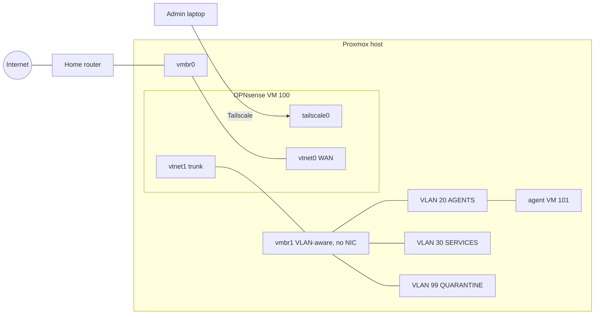

# Self-Hosted AI Agent Homelab

A segmented, zero-exposure home lab for running AI agents (OpenClaw, Hermes) on my own hardware instead of a rented VPS.
Every packet an agent sends passes through a firewall I control, nothing in the lab is reachable from the internet,
and the whole lab is administered remotely from another country.

> **Status (October 2026):** network, firewall, remote access and the first agent VM are complete and verified.
> Agent software installation is next. See [Roadmap](#roadmap).

---

## Highlights

- **Zero inbound exposure** – no open ports and no port forwards on WAN. Remote administration runs over Tailscale (outbound NAT traversal only).
- **OPNsense as the single policy engine** – routing, filtering, DNS and DHCP for all internal zones. The Proxmox firewall is deliberately disabled on firewall-facing NICs.
- **Three isolated zones** – `AGENTS`, `SERVICES` and `QUARANTINE` VLANs on an internal-only bridge with no physical NIC.
- **Internet-only agents** – agents can reach the internet and the firewall's DNS, nothing else: no home network, no management LAN, no other VLANs, no tailnet.
- **Forced DNS through the firewall** – outbound DNS to any other resolver is blocked and logged (bypass and DNS-tunnelling resistance).
- **Containment by design** – retagging a VM to VLAN 99 cuts it off completely while it keeps running for analysis.
- **Default-deny tailnet** – Tailscale's allow-all default replaced with a tested policy: only the admin laptop may initiate connections.
- **Verified, not assumed** – isolation proven with tests from inside the agent zone; two non-obvious failures found and fixed through log evidence ([troubleshooting](docs/troubleshooting.md)).

## Architecture

```
                      ┌──────────────────── Proxmox VE host (myserver) ───────────────────┐
Internet ── Home ─────┼── USB NIC ── vmbr0 (<HOME_LAN_CIDR>, host .100)                     │
            router    │                │                                                   │
           .0.1       │      net0/vtnet0  WAN <HOME_LAN_WAN_IP> (DHCP)                           │
                      │      ┌─────────────────────┐                                       │
                      │      │   OPNsense (VM 100) │  tailscale0 <OPNSENSE_TAILSCALE_IP>             │
                      │      │   router + firewall │  (subnet router, SNAT disabled)       │
                      │      └─────────────────────┘                                       │
                      │      net1/vtnet1  LAN <OPNSENSE_LAN_IP>/24 (untagged, no DHCP)            │
                      │                │  802.1Q trunk                                     │
                      │      vmbr1 (VLAN-aware, NO physical NIC)                           │
                      │        ┌───────────────┼──────────────────┐                        │
                      │     VLAN 20          VLAN 30           VLAN 99                     │
                      │     AGENTS          SERVICES         QUARANTINE                    │
                      │   <VLAN_AGENTS_CIDR>   <VLAN_SERVICES_CIDR>     <VLAN_QUARANTINE_CIDR>                  │
                      │   agent VM 101                                                     │
                      └────────────────────────────────────────────────────────────────────┘

Admin laptop ┄┄ Tailscale ┄┄> OPNsense GUI :443      (OPNsense rule: laptop only)
             ┄┄ Tailscale ┄┄> agents :22 via OPNsense (Tailscale policy + OPNsense rule)
             ┄┄ Tailscale ┄┄> Proxmox host           (independent out-of-band path)
```



## Stack

| Component | Role |
|---|---|
| Proxmox VE | Hypervisor (single node) |
| OPNsense 26.7.5 | Firewall, router, VLAN gateway |
| Unbound | Recursive, caching, DNSSEC-validating resolver (port 53) |
| Dnsmasq | DHCP for the VLANs (its DNS moved to port 53053) |
| Tailscale | Remote administration and subnet routing (os-tailscale plugin) |
| Ubuntu Server 24.04 LTS | Agent VM operating system |

## Documentation

| Document | Contents |
|---|---|
| [docs/network.md](docs/network.md) | Addressing plan, interfaces, VLANs, bridge configuration, DHCP and DNS |
| [docs/firewall-rules.md](docs/firewall-rules.md) | Every rule per zone, with rationale and rule order |
| [docs/remote-access.md](docs/remote-access.md) | Tailscale design, tailnet policy, subnet routing and SNAT |
| [docs/agent-vm.md](docs/agent-vm.md) | Agent VM build and hardening baseline |
| [docs/verification.md](docs/verification.md) | Isolation test plan and results |
| [docs/troubleshooting.md](docs/troubleshooting.md) | Case studies of real failures and how they were diagnosed |
| [docs/decisions.md](docs/decisions.md) | Design decision log |
| [docs/runbook.md](docs/runbook.md) | Operational procedures: snapshots, backups, recovery, quarantine |
| [configs/tailscale-policy.hujson](configs/tailscale-policy.hujson) | Tailnet access policy with built-in tests |

## Verification summary

Tests run from the agent VM (`<AGENT_VM_IP>`) in VLAN 20:

| Test | Expected | Result |
|---|---|---|
| DHCP lease | Address in `<VLAN_AGENTS_DHCP_RANGE>` | ✅ |
| Ping gateway `<VLAN_AGENTS_GATEWAY_IP>` | Reply | ✅ |
| `nslookup github.com` (firewall resolver) | Resolves | ✅ |
| `curl -I https://example.com` | Works | ✅ |
| `nslookup github.com 8.8.8.8` | Blocked, logged | ✅ |
| `curl -k https://<OPNSENSE_LAN_IP>` (firewall GUI) | Blocked, logged | ✅ |
| `ping <HOME_GATEWAY_IP>` (home network) | Blocked, logged | ✅ |
| `ping <PROXMOX_TAILSCALE_IP>` (Proxmox via tailnet) | Blocked, logged | ✅ |

Remote SSH enforcement: with the OPNsense SSH rule disabled, SSH to the agent is blocked by default deny; with it enabled, it passes and is logged with the laptop's real source address. Full details in [docs/verification.md](docs/verification.md).

## Roadmap

- [x] OPNsense install, setup wizard, firmware updates
- [x] Tailscale remote administration with zero WAN exposure
- [x] VLAN segmentation, DHCP, DNS and zone firewall rules
- [x] Agent VM (Ubuntu 24.04) with key-only SSH
- [x] Isolation verified from inside the agent zone
- [x] Default-deny tailnet policy; OPNsense enforcement of agent SSH (SNAT disabled)
- [ ] Service account for agents (no sudo, no login shell); listening-services review
- [ ] Install agents as systemd services with secrets kept out of the repository
- [ ] Monitoring: Unbound query logging and firewall log review
- [ ] Optional: Cloudflare Tunnel for public endpoints, DoT (853) blocking, per-agent VLANs, trunk VLAN pruning

## Known limitations

- DNS over HTTPS cannot be blocked by port; only classic DNS (53) is enforced.
- Traffic between hosts in the same VLAN does not traverse OPNsense. Separate agents should live in separate VMs and, where needed, separate VLANs.
- The single USB Ethernet adapter is a physical single point of failure for the whole lab.

---

*Built and documented by Mohammad Asuni bin Tarmizi.*
